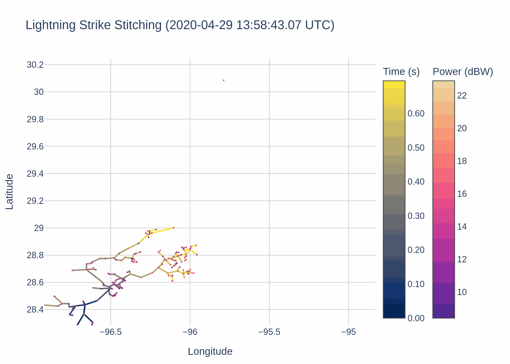

# Connor's Lightning Parser Lib (LPL)

The Connor's Lightning Parser Lib (LPL) is an extremely powerful analysis utility with a simplistic front-end in mind.

The analyzer is capable of processing millions of LYLOUT datapoints in mere minutes by using a SQL database back-end for initial filtering, and then uses optimized work-arounds for computationally expensive methods that omit square-root and trig functions for distances between points. Not to mention it's back-end parses most data with indexes (list[int], list[list[int]], etc.) instead of the entire data itself. Additionally, it uses multi-processing when necessary to accelerate processes.

>[!NOTE]
>The stitchings are done on a temporal and delta-magnitude basis. This basically means that scipy's cKDTree, despite being powerful and timely, does not include temporal thresholds and therefore would not accurately stitch lightning points that respect the lightning strike. Therefore, this code will go from 4 minutes with 3 million points to 2 hours for 10 million points. I will likely switch to C or C++ down the line to improve processing time. But for now, this is the most optimized Python library I can make for temporal distance lightning stitching.

All of these methods allow extremely fast computation times, given the immense scale and size of the data itself.




This library extracts LYLOUT data, store it into a lightning database, and processes millions of datapoints in the database to a reasonably fast and optimized speed. This project is meant to be a framework for applications to implement and parse data more appropriately.

Assuming the following specs (tested on a laptop with Ubuntu 22.04):
 - 64 GB DDR4 RAM
 - RTX 2060 Mobile (6GB)
 - Intel i7-10750H (6 Cores -> 12 Threads)
 - Python 3.12.3 (Regular version/Not conda)


Three million datapoints should take roughly 4 minutes to process (excluding generating plots). Running the same exact parameters again would take 18-20 seconds due to caching.

## Start

### Getting Started

1. Git clone the project
`git clone https://github.com/CorniiDog/lightning_research_database.git`

2. Open the project in VSCode

3. Create a virtual environment (`cmd+shift+p` for MACOS or `ctrl+shift+p` for Windows) -> "Python:Select Interpreter" -> ".venv" and then select a specified version.

4. Either check the box for "requirements.txt" before continuing, or after re-opening the terminal to do `pip install -r requirements.txt`

### To Run the project

1. Drag and drop your LYLOUT text files into "lylout_files" directory.


2. Modify the filters in "main.py":
```py
start_time = datetime.datetime(2020, 4, 29, 0, 0, tzinfo=datetime.timezone.utc).timestamp()  # Timestamp converts to unix (float)
end_time = datetime.datetime(2020, 4, 29, 23, 59, tzinfo=datetime.timezone.utc).timestamp()  # Timestamp converts to unix (float)


# Build filter list for time_unix boundaries.
# Look at "List of headers" above for additional
# Filterings
filters = [
        ("time_unix", ">=", start_time),  # In unix
        ("time_unix", "<=", end_time),  # In unix
        ("reduced_chi2", "<", 5.0,),  # The chi^2 (reliability index) value to accept the data
        ("num_stations", ">=", 5),  # Number of stations that have visibly seen the strike
        ("alt", "<=", 24000),  # alt is in meters. Therefore 20 km = 20000m
        ("alt", ">", 0),  # Above ground
        ("power_db", ">", -4),  # In dBW
        ("power_db", "<", 50),  # In dBW
    ]
```

3. Modify parameters
```py
# Additional parameters that determines "What points make up a single lightning strike"
# They are explicitly defined
params = {
        # Creating an initial lightning strike
        "max_lightning_dist": 30000,  # Max distance between two points to determine it being involved in the same strike
        "max_lightning_speed": 1.4e8,  # Max speed between two points in m/s (essentially dx/dt)
        "min_lightning_speed": 0,  # Min speed between two points in m/s (essentially dx/dt)
        "min_lightning_points": 100,  # The minimum number of points to pass the system as a "lightning strike"
        "max_lightning_time_threshold": 0.3,  # Max number of seconds between points 
        "max_lightning_duration": 30, # Max seconds that define an entire lightning strike. This is essentially a "time window" for all of the points to fill the region that determines a "lightning strike"

        # Combining intercepting lightning strike data filtering
        "combine_strikes_with_intercepting_times": True, # Set to true to ensure that strikes with intercepting times get combined. 
        "intercepting_times_extension_buffer": 0.6, # Number of seconds of additional overlap to allow an additional strike to be involved
        "intercepting_times_extension_max_distance": 100000, # The max distance between the start point of one lightning strike and at least one from the entirety of another lightning strike's points
    }

```

4. Run with `python run main.py` and observe the images in their respective directories

> [!NOTE]
> Some individuals may upload a compressed LYLOUT file without adding a suggestive extension filename. Make sure that all LYLOUT files are able to be readable as a text file. If they are not, they are likely compressed, with or without the extension name. It is suggested to try to add the ".gz" extension at the end manually by renaming the file, and attempt to unzip it. If that is not successful, try adding ".zip" and attempt to unzip.
>
>

> [!NOTE]
> When data is added to "lylout_files", everything gets hashed and recorded into "lylout_db.db". This ".db" file is a SQL database that stores all historical lightning strikes. If the database is becoming too large, you can simply delete the "lylout_db.db" file.


## Useful Functions

- Run in background: `python main.py > output.log 2>&1 & disown`

- List all files in directory './' and sizes: `du -h --max-depth=1 ./ | sort -hr`

- `./.venv/bin/python main.py`

- `./.venv/bin/python main.py > output.log 2>&1 & disown`

- `./.venv/bin/pip install -r requirements.txt`

- `./.venv/bin/pip show setuptools`
